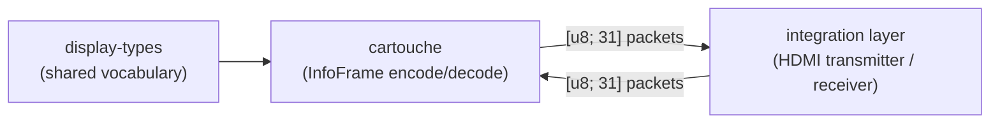
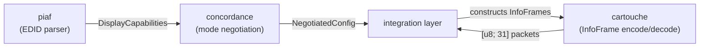

# cartouche

[](https://github.com/DracoWhitefire/cartouche/actions/workflows/ci.yml)
[](https://crates.io/crates/cartouche)
[](https://docs.rs/cartouche)
[](https://github.com/DracoWhitefire/cartouche/blob/main/LICENSE)
[](https://blog.rust-lang.org/2025/02/20/Rust-1.85.0.html)

Encoding and decoding for HDMI InfoFrames.

cartouche encodes and decodes HDMI 2.1 InfoFrames: AVI, Audio, HDR Static Metadata, and
HDMI Forum Vendor-Specific frames are fully supported; Dynamic HDR fragment decoding and
sequence assembly are implemented, with per-format metadata structs planned. It is a pure
encoding/decoding library with no I/O and no allocation requirement.

InfoFrames are the auxiliary metadata packets transmitted in the data island periods of an
HDMI signal. The AVI InfoFrame signals color space and colorimetry; the HDR InfoFrames
carry mastering metadata and dynamic tone mapping parameters; the HDMI Forum VSI signals
ALLM, VRR, and DSC state.

```rust
use cartouche::avi::{
    AviInfoFrame, BarInfo, Colorimetry, ExtendedColorimetry, ItContentType,
    NonUniformScaling, PictureAspectRatio, RgbQuantization, ScanInfo, YccQuantization,
};
use cartouche::encode::IntoPackets;
use display_types::ColorFormat;

// Encode
let frame = AviInfoFrame {
    color_format: ColorFormat::Rgb444,
    colorimetry: Colorimetry::NoData,
    extended_colorimetry: ExtendedColorimetry::XvYCC601,
    picture_aspect_ratio: PictureAspectRatio::SixteenByNine,
    active_format_present: false,
    active_format_aspect_ratio: 0,
    bar_info: BarInfo::NotPresent,
    scan_info: ScanInfo::NoData,
    it_content: false,
    it_content_type: ItContentType::Graphics,
    rgb_quantization: RgbQuantization::Default,
    ycc_quantization: YccQuantization::LimitedRange,
    non_uniform_scaling: NonUniformScaling::None,
    vic: 16,
    pixel_repetition: 0,
    top_bar: 0,
    bottom_bar: 0,
    left_bar: 0,
    right_bar: 0,
};
for packet in frame.into_packets() {
    transmit(&packet);  // your integration layer
}

// Decode
let decoded = AviInfoFrame::decode(&packet)?;
let frame = decoded.value;
for warning in decoded.iter_warnings() {
    eprintln!("warning: {:?}", warning);
}
```

The top-level `decode` function dispatches on the type code and returns an `InfoFramePacket`:

```rust
use cartouche::decode;

match decode(&packet)?.value {
    InfoFramePacket::Avi(f)          => { /* f: AviInfoFrame */ }
    InfoFramePacket::Audio(f)        => { /* f: AudioInfoFrame */ }
    InfoFramePacket::HdrStatic(f)    => { /* f: HdrStaticInfoFrame */ }
    InfoFramePacket::HdmiForumVsi(f) => { /* f: HdmiForumVsi */ }
    InfoFramePacket::DynamicHdrFragment(frag) => { /* accumulate sequence */ }
    InfoFramePacket::Unknown { type_code, .. } => { /* unrecognised type */ }
}
```



## Why cartouche

**Complete coverage.** All five HDMI 2.1 InfoFrame type codes are handled. The four
traditional types (AVI, Audio, HDR Static, HDMI Forum VSI) are fully encoded and decoded;
Dynamic HDR fragment decode and sequence assembly are implemented, with per-format metadata
structs (HDR10+, SL-HDR) planned.

**Typed fields, not raw bytes.** Color spaces are enums, not integers. VICs are validated
values, not raw `u8`s. Raw bytes appear only in `Unknown` variants, where they are
preserved exactly because the type is not understood.

**Warnings without data loss.** Anomalous input (bad checksum, reserved field,
out-of-spec value) produces a warning on the returned frame, not an error. The caller
receives the data and the warning; nothing is silently discarded. Truncation is the
only hard error.

**Dynamic HDR is first-class.** The `IntoPackets` abstraction and the decode API are
designed for both single-packet and multi-packet (Dynamic HDR) frame types from the
start. The integration layer's transmission loop is identical for all frame types:

```rust
for packet in frame.into_packets() {
    transmit(&packet);
}
```

**No allocation.** All encoding and decoding is done without a heap. The `Iter`
associated type on `IntoPackets` is a state machine that owns the frame — no `Vec`,
no lifetime parameters.

**No unsafe code.** `#![forbid(unsafe_code)]`.

## Features

| Feature | Default | Description                                                  |
|---------|---------|--------------------------------------------------------------|
| `std`   | yes     | Enables `std` support; implies `alloc`                       |
| `alloc` | no      | Enables `alloc` without `std`; `Decoded<T,W>` uses `Vec<W>` |
| `serde` | no      | Derives `Serialize`/`Deserialize` on all public types        |

Without `alloc` or `std`, `Decoded<T, W>` stores up to 8 warnings in a fixed
`[Option<W>; 8]` array. Access is always through `iter_warnings()`, which is portable
across all build configurations.

## `no_std` builds

cartouche declares `#![no_std]`. All encoding is done through iterators over
stack-allocated state; all decoding takes caller-provided slices. Neither encoding nor
decoding touches the heap.

The `alloc` feature (implied by `std`) switches `Decoded<T, W>`'s warning storage from
a fixed array to a `Vec<W>`, removing the 8-warning cap. All other behaviour is
identical across build tiers.

## Stack position

cartouche is the InfoFrame encoding layer. concordance produces the negotiated
configuration that cartouche encodes; the integration layer transmits and receives the
resulting packets.



## Documentation

Extended documentation lives under [`doc/`](doc/).

- [`doc/architecture.md`](doc/architecture.md) — wire format, encode/decode abstraction, InfoFrame types, and design principles
- [`doc/setup.md`](doc/setup.md) — build, test, and fuzzing commands
- [`doc/testing.md`](doc/testing.md) — testing strategy and fuzz targets
- [`doc/roadmap.md`](doc/roadmap.md) — planned features and future work
